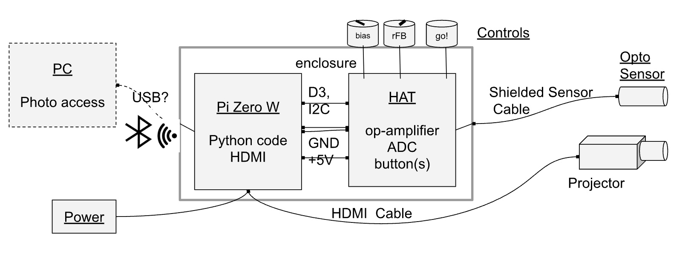
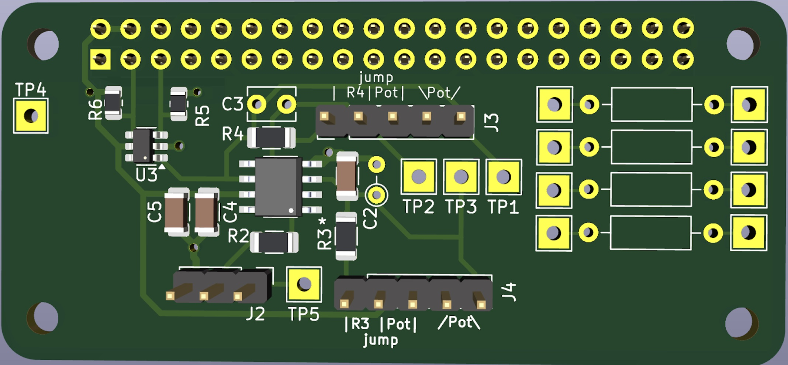
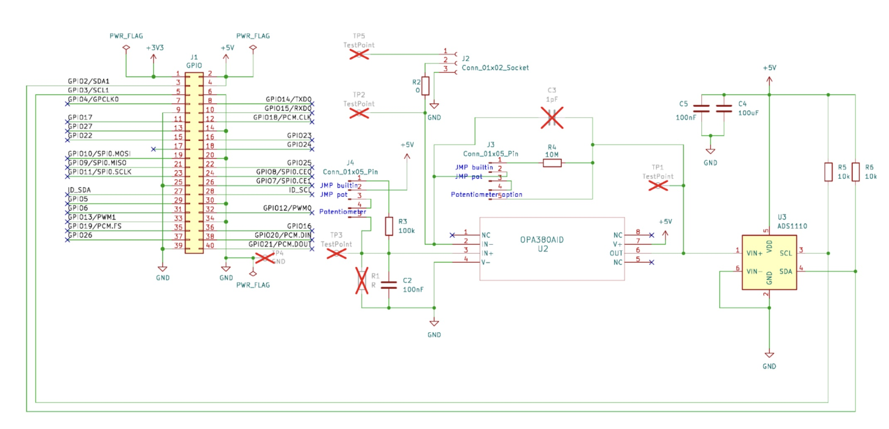

This is a Raspberry Pi Hat for the "Camera Mascara" mark 2, containing a photodiode transimpedance amplifier and an ADC with a bunch of breakout options for experimenting with the gain and other options, live a dev board.

See the other two related repos: 
- https://github.com/scipilot/camera-mascara-vue-pocketbase
- https://github.com/scipilot/camera-mascara

## How to use

The circuit has options, but also fair defaults so you can just plug in a photodiode to J2, jump J4 pins 1-2 and jump J3 pins 1-2. 

The jumper options were intended to facilitate trialling different opamp designs not just passive values, while still using well-soldered SMD components, avoiding breadboard problems. There are many ways to feed a photodiode signal into an opamp, so I wanted to enable radical changes to the circuit - although probably could have done much better with a more open "protoboard" type layout. The default design is a transimpedance amplifier, where the photodiode reverse bias is also generated via the opamp as the negative feedback tries to keep the inverting input the same as the non-inverting input which itself is held at the bias level.

The default Rfb 10MΩ turned out to be too high (for the Hamamatsu diode I tried). But a 1.6MΩ pot on J3 (on pins 4-5, with pins 2-3 jumped) was very useful for various level experiments. Somewhere around 500kΩ is probably a good starting point.

The potentiometer option on J4 turned out not to be so useful, but installing R1 was more useful in setting the reverse bias of the photodiode. It depends on the photodiode, but keeping the bias as low as possible (while still performing its function) helps to keep the output level down lower which was more compatible with the ADC (especially without the VIN-neg bias option). I installed a 25kΩ R1 which leads to a 1V reverse bias, (25:100 divider of 5V on the Pi supply) which is safely above the 0.7V minimum reverse bias of the Hamamatsu diode.

The 0Ω links were also intended to be removable, but in reality it's pretty difficult at that size!

The opamp capacitors aren't so important these low frequencies - they are in the reference designs which are more concerned with high-frequency designs. 

Shielding the cable to the photosensor is important, which can be connected to Pin 1 of J2 and linked to GND. This significantly reduces mains hum, especially with higher amplification of very low light levels (single pixel mask).

The ADS1110 is IC2 addressed according to the variant, so e.g. ADS1110-ED0 is on address 0x48. The ADS1110 does not use registers so some standard tools don't work with it, as they commonly write a register address before reading which will overwrite the config of this chip. 

The ADS1110 has four possible differential ranges: -2V to +2V at PGA (gain) x1, down to -0.25 to +0.25V at PGA gain x8. 

Note: As we are measuring positive going signals (not AC or audio) but the ADC is differential, the input should to biased to the bottom of this range to enable us to use the full range. To do this you can supply 1V or 2V to the negative input. I did not facilitate this option in the first version of the schematic, and sadly routed the VIN-neg pin to the GND under the chip which made it difficult to amend (desolder chip and cut the track or lift the pin)! I have remedied this in v2 of the schematic (not manufactured yet). This bias could also be achieved in the output of the opamp or other ways, but the VIN-neg is the easiest.

TP1 is the most interesting signal to probe. Ensuring it's clean and not going to clip outside the range of the ADC is crucial. 

TP2 isn't really useful, as the signal is a current not voltage.  TP3 was used in experiments to record the PD rev-bias and its effect on the performance.

I added a bunch of other proto-board-like component positions and jumper/vias which are not on the schematic. These were useful to be able to hard-solder optional things like a 1V voltage divider for the VIN-neg ADC input after cutting the strap to 0V.

There are no TPs for the I2C for debugging which will also be remedied in v2.

The components I chose were swayed by what was available at JLCPCB (or LCSC).

Next steps: v2 will have the amendments mentioned, plus possible a triple diode layout, for doing RGB images, or a double-diode for monitoring background light levels, perhaps a different non-differential ADC or with less weird I2C.

